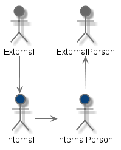
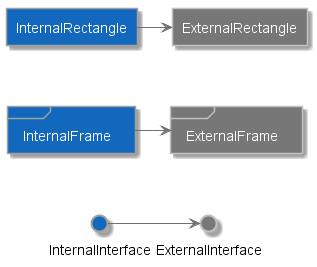
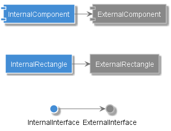
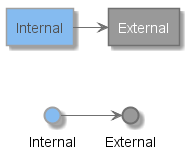

# C4-PlantumlSkin
Some skinning to create C4 diagrams

## Prerequisites
---

Before you start, you need to be familiar at minimum with:

- [PlantUml](http://plantuml.com/index)
- [C4 model](https://c4model.com/)

First of all you need to have plantuml up and running. For this you have multiple options (all of which will work with this):

1. [Local installation](http://plantuml.com/starting)
1. [Free online editor](https://www.planttext.com/)
1. [VisualStudio Code Plugin](https://github.com/qjebbs/vscode-plantuml): This plugin allows you to "embed" diagrams in your markdown files, which is the best of all worlds in my opinion, and is hence really recommended.

Once you have something running (or just went to planttext online editor), you can start using plantuml to create text-driven models and diagrams.

## Quickstart
---

Assuming that you have an environment that you can use PlantUml, add the following line:
```plantumlcode
!includeurl https://raw.githubusercontent.com/skleanthous/C4-PlantumlSkin/master/build/output/c4.puml
```
Just below `@startuml`, and then use the following components with the specified stereotype:

| C4 artifact | PlantUml | Stereotype for internal | Stereotype for external |
|---|---|---|---|
| Person | `actor` | `<<Internal>>` | `<<External>>` |
| System | `frame` | `<<Internal System>>` <br> `<<Internal>>` <br> `<<System>>` | `<<External System>>` <br> `<<External>>` |
| System | `rectangle` | `<<Internal System>>` <br> `<<System>>` | `<<External System>>` |
| Containers | `component` | `<<Internal Container>>` <br> `<<Internal>>` <br> `<<Container>>` | `<<External Container>>` <br> `<<External>>` |
| Containers | `rectangle` | `<<Internal Container>>` <br> `<<Container>>` | `<<External Container>>` |
| Component | `rectangle` | `<<Internal Component>>` <br> `<<Component>>` | `<<External Component>>` |
| Database | `database` | `<<Internal Database>>` <br> `<<Internal>>` |  `<<External Database>>` <br> `<<External>>` |
| Queue | `queue` | `<<Internal Queue>>` <br> `<<Internal>>` |  `<<External Queue>>` <br> `<<Queue>>` |
| Expanded systems, <br> containers and components | `frame` <br> `component` <br> or `rectangle` <br> according to your need | `<Expanded>` | `<Expanded>` |

## Examples
---

Reproduced (as closely as possible from diagrams from [the official C4 model website](https://c4model.com/))

1. System Context diagram

    [PlantUml file for diagram below](./sample/c4-banking-system.puml)
    
    

2. Container diagram

    [PlantUml file for diagram below](./sample/c4-banking-container.puml)

    

3. Component diagram

    ## _**!!!TODO!!!**_

## Brief description
---

This project will help you use the awesome plantuml tool to create C4 diagrams for documenting architecture.

C4 defines a set of diagrams (core and supplamentary) that are designed to document architecture in a way that is easy to understand and communicate.

PlantUml is a uniquely pleasant-to-use tool to create diagrams from text. The fact that this is a text-driven tool opens up a lot of previously impossible scenarios:

1. It is a *pleasure* to edit
1. You don't need special tooling
1. You can keep your domain models side-by-side with your code
1. You can embedd models in your markdown documents in almost all major editors
1. Did I mention that it is an absolute pleasure to work with plantuml?

The only real disadvantage to plantuml is that positioning can sometimes be a bit hard.

This tool allows you to use stereotypes to skin your diagram to be close to what is standard with C4. You can use this include to skin the following diagrams:

1. System Context diagram
1. Container diagram
1. Component diagram
1. System Landscape diagram
1. Dynamic diagram
1. Dynamic diagram

## Instructions
---

All that is needed to start is to add the following line:
```plantumlcode
!includeurl https://raw.githubusercontent.com/skleanthous/C4-PlantumlSkin/master/build/output/c4.puml
```

> **NOTE**: This will set your diagram type as a deployment diagram. If you want to add some incompatible artifacts in your diagram, please also add the following statement below the `includeurl` one
> ```plantumlcode
> allowmixing
> ```

1. ### Stereotypes and legend

    As mentioned above, the way that you would skin your artifacts is through the use of stereotyping. Due to this, currently stereotype names are not emitted, but instead, a legend is emited on the bottom right. At this time it cannot be turned off.

2. ### Represent C4 Person --> with PlantUml Actors

    There is support for two types of actors. Internal and external actors. The supported stereotypes are:
    - `<<Internal>>`
    - `<<External>>`
    
    The following code:

    ```plantumlcode
    @startuml
    !define NO_LEGEND

    !includeurl https://raw.githubusercontent.com/skleanthous/C4-PlantumlSkin/master/build/output/c4.puml

    actor Internal <<Internal>>
    actor External <<External>>
    actor InternalPerson <<Internal Person>>
    actor ExternalPerson <<External Person>>

    External -down-> Internal
    Internal -right-> InternalPerson
    InternalPerson -up-> ExternalPerson

    @end
    ```

    Produces this outcome:

    

3. #### Represent C4 Systems --> with PlantUml Rectangles and Frames

    C4 Systems can be reprensented using PlantUml rectangles and frames. In both cases the stereotypes that could be used are:

    > **NOTE**: the simplicity of rectangles makes them really useful if you want to avoid the connotations implied by UML artifacts, so they are used to represent other C4 artifacts too

    - `<<Internal System>>`
    - `<<System>>` (an alias to `<<Internal System>>`)
    - `<<External System>>`

    The following code:

    ```plantumlcode
    @startuml
    !define NO_LEGEND

    !includeurl https://raw.githubusercontent.com/skleanthous/C4-PlantumlSkin/master/build/output/c4.puml

    rectangle Internal <<Internal System>>
    frame AnotherInternal <<System>>
    rectangle External <<External System>>
    frame AnotherExternal <<External System>>

    Internal -right-> External
    Internal -[hidden]down-> AnotherInternal
    AnotherInternal -right-> AnotherExternal

    @enduml
    ```

    Produces the outcome:

    

4. #### Represent C4 Containers --> with PlantUml Rectangle and Components

    C4 containers can be repesented by using plantuml rectangles  (and not C4 components which is a bit confusing), which are useful to be shown normally on `System Context`, `Container` and `System Landscape` diagrams. The supported stereotypes are:
    
    - `<<Internal Container>>`
    - `<<Container>>` (an alias to `Internal Container`)
    - `<<External Container>>`

    The following code:

    ```plantumlcode
    @startuml
    !define NO_LEGEND

    !includeurl https://raw.githubusercontent.com/skleanthous/C4-PlantumlSkin/master/build/output/c4.puml

    component InternalComponent <<Internal Container>>
    component ExternalComponent <<External Container>>

    rectangle InternalRectangle <<Internal Container>>
    rectangle ExternalRectangle <<External Container>>

    InternalComponent -right-> ExternalComponent
    InternalComponent -[hidden]down-> InternalRectangle
    InternalRectangle -right-> ExternalRectangle

    @enduml
    ```

    Produces this outcome:

    

5. #### Represent C4 components --> with PlantUml rectangles

    C4 components can currently only be represented by plantuml rectangles. The are only really usesful in `Component` C4 diagrams, but obviously really important. The stereotypes used 

    - `<<Internal Component>>`
    - `<<Component>>` (an alias to `<<Internal Component>>`)
    - `<<External Component>>`

    The following code:

    ```plantumlcode
    @startuml
    !define NO_LEGEND

    !includeurl https://raw.githubusercontent.com/skleanthous/C4-PlantumlSkin/master/build/output/c4.puml

    rectangle Internal <<Internal Component>>
    rectangle External <<External Component>>

    Internal -right-> External

    @enduml
    ```

    Produces this outcome:

    

6. #### More details

    The above should be enough to get you started. For more info please see:

    - [Items definitions](./src/items)
    - [PlantUml files for the sample diagrams](./sample/)
    - [List of all supported artifacts](./docs/diagrams/)

## work outstanding

1. Complete examples
1. Add skinning for C4 Code diagrams 

## Inspiration \ Acknowledgements
---

Basically the only acknowledgement is [C4-PlantUML](https://github.com/RicardoNiepel/C4-PlantUML) from [Ricardo Niepel](https://github.com/RicardoNiepel). This is a very good library to work with C4, but I wanted something much more native to plantuml. Specifically I wanted to be able to work with artifacts native to plantuml (`rectangle`, `queue`, `component`, etc.) instead of the "method"-like means that this library exposes.